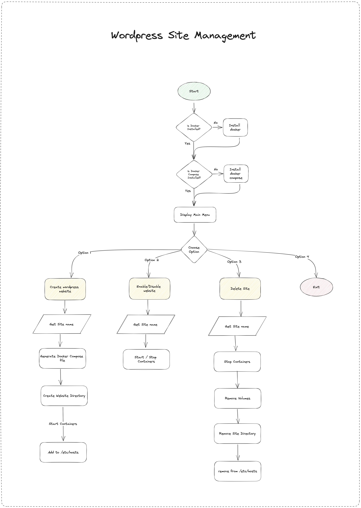

# Design Document for WordPress

# Project Overview:

This project aims to provide a command-line tool for managing WordPress sites using Docker and Docker Compose. It automates the creation, enabling/disabling, and deletion of WordPress sites, making it easier for users to manage their WordPress development environments.

## Problem Statement:

Managing multiple WordPress sites and their associated Docker containers manually can be time-consuming and error-prone. This script simplifies the process by providing a streamlined workflow for site creation, management, and deletion.

### Intended Users:

- Developers or system administrators who work with multiple WordPress sites and need an efficient way to manage them.
- Users familiar with Docker and Docker Compose who want to simplify their WordPress site management tasks.

### Goals of the Project:

- The goal of this project is to develop a script that simplifies WordPress site management using Docker and Docker Compose.
- Milestones:
    1. Implement basic functionality to create a WordPress site with Docker Compose.
    2. Add functionality to enable/disable a site by starting/stopping containers.
    3. Implement the ability to delete a site and remove associated containers and volumes.

### Scope of the Project:

- The project will provide a command-line tool that automates the creation, enabling/disabling, and deletion of WordPress sites using Docker and Docker Compose.
- **Functional Requirements:**
    - Create a WordPress site with a specified name.
    - Enable/disable a site by starting/stopping associated containers.
    - Delete a site and remove associated containers and volumes.
- **Non-functional Requirements:**
    - The script should be easy to use, with clear prompts and instructions.
    - It should handle errors and provide informative error messages.
    - The script should be efficient and perform the required actions quickly.

### High-Level System Design:

- The system consists of the following components:
    - User Interface (command-line interface)
    - Site Creation Module
    - Site Management Module
    - Site Deletion Module
- These components interact with Docker and Docker Compose to create, manage, and delete WordPress sites.
- Data flows between the components and Docker containers to set up and control the WordPress environment.

## Functionalities / Workflows:

- **Workflow 1: Create a WordPress site**
    - User provides a site name.
    - Docker Compose file is generated with the specified site name.
    - Site directory is created, and containers are started.
    - Hosts file is updated to map the site name to localhost.
- **Workflow 2: Enable/Disable a site**
    - User selects the site to enable/disable.
    - Corresponding containers are started/stopped based on the user's choice.
- **Workflow 3: Delete a site**
    - User selects the site to delete.
    - Containers and associated volumes are stopped and removed.
    - Site directory is deleted, and hosts file entry is removed.

## TLDR:

This project aims to simplify WordPress site management using Docker and Docker Compose. It provides a command-line tool for creating, enabling/disabling, and deleting WordPress sites. The script automates the setup and management process, improving efficiency for developers and administrators. Future improvements could include enhanced error handling, better performance optimization, and additional management features.